# ERP School Management System - Entity Relationship Diagram

## Complete Database Schema Overview

This document presents the comprehensive Entity Relationship diagram for the ERP School Management System backend.

## Mermaid ER Diagram

```mermaid
erDiagram
    %% Core System Entities
    SCHOOL {
        ObjectId _id PK
        string name
        string email UK
        string phone
        string address
        string state
        string city
        string pincode
        string slug UK
        enum status
        string logo
        string board
        Date createdAt
        Date updatedAt
    }

    ACADEMIC_YEAR {
        ObjectId _id PK
        ObjectId school_id FK
        string name
        Date start_date
        Date end_date
        boolean is_current
        enum status
        Date createdAt
        Date updatedAt
    }

    %% User Management
    USER {
        ObjectId _id PK
        ObjectId school_id FK
        string usergroup_id
        string name
        string first_name
        string last_name
        string email UK
        string password
        string mobile_no
        array roles
        array permissions
        string profile_picture
        enum user_type
        boolean is_active
        Date last_login
        Date createdAt
        Date updatedAt
    }

    USER_PROFILE {
        ObjectId _id PK
        ObjectId user_id FK "UNIQUE"
        ObjectId school_id FK
        string firstname
        string lastname
        enum gender
        Date date_of_birth
        string blood_group
        string nationality
        string religion
        object address
        string country_id
        string state_id
        string city_id
        Date createdAt
        Date updatedAt
    }

    %% Academic Structure
    SECTION {
        ObjectId _id PK
        ObjectId school_id FK
        ObjectId academic_year_id FK
        ObjectId class_teacher_id FK
        string name
        number standard
        number capacity
        number current_strength
        string room_number
        enum shift
        Date createdAt
        Date updatedAt
    }

    SUBJECT {
        ObjectId _id PK
        ObjectId school_id FK
        ObjectId academic_year_id FK
        string name
        string code UK
        enum type
        array standards
        number total_periods_per_week
        number max_marks
        number pass_marks
        boolean is_active
        Date createdAt
        Date updatedAt
    }

    %% Student Management
    STUDENT {
        ObjectId _id PK
        ObjectId user_id FK "UNIQUE"
        ObjectId school_id FK
        ObjectId academic_year_id FK
        ObjectId section_id FK
        ObjectId route_id FK
        number standard
        string roll_no
        string admission_no UK
        Date admission_date
        enum status
        string blood_group
        array parent_ids
        object medical_info
        Date createdAt
        Date updatedAt
    }

    %% Staff Management
    TEACHER {
        ObjectId _id PK
        ObjectId user_id FK "UNIQUE"
        ObjectId school_id FK
        string employee_id UK
        Date joining_date
        enum status
        string designation
        string department
        array subjects
        array classes
        string qualification
        number salary
        object banking_details
        Date createdAt
        Date updatedAt
    }

    TEACHER_ASSIGNMENT {
        ObjectId _id PK
        ObjectId school_id FK
        ObjectId academic_year_id FK
        ObjectId teacher_id FK
        ObjectId subject_id FK
        ObjectId section_id FK
        number standard
        number periods_per_week
        enum assignment_type
        boolean is_class_teacher
        Date createdAt
        Date updatedAt
    }

    %% Exam System
    EXAM {
        ObjectId _id PK
        ObjectId school_id FK
        ObjectId academic_year_id FK
        string name
        enum exam_type
        Date start_date
        Date end_date
        array standards
        enum status
        array subjects
        boolean is_published
        Date createdAt
        Date updatedAt
    }

    MARK {
        ObjectId _id PK
        ObjectId school_id FK
        ObjectId exam_id FK
        ObjectId student_id FK
        ObjectId entered_by FK
        string subject
        number marks_obtained
        number total_marks
        number percentage
        string grade
        boolean is_absent
        Date createdAt
        Date updatedAt
    }

    %% Library Management
    BOOK {
        ObjectId _id PK
        ObjectId school_id FK
        string book_no UK
        string title
        string author
        string isbn
        string category
        string publisher
        number total_copies
        number available_copies
        string rack_no
        number price
        Date createdAt
        Date updatedAt
    }

    LIBRARY_BOOK {
        ObjectId _id PK
        string title
        string author
        string isbn UK
        string publisher
        string category
        number total_copies
        number available_copies
        Date createdAt
        Date updatedAt
    }

    BOOK_ISSUE {
        ObjectId _id PK
        ObjectId school_id FK
        ObjectId book_id FK
        ObjectId issued_to FK
        ObjectId issued_by FK
        enum user_type
        Date issue_date
        Date due_date
        Date return_date
        enum status
        number fine_amount
        Date createdAt
        Date updatedAt
    }

    %% Fee Management
    FEE_STRUCTURE {
        ObjectId _id PK
        ObjectId school_id FK
        ObjectId academic_year_id FK
        number standard
        string fee_type
        number amount
        enum frequency
        boolean is_mandatory
        Date createdAt
        Date updatedAt
    }

    STUDENT_FEE {
        ObjectId _id PK
        ObjectId student_id FK
        ObjectId school_id FK
        ObjectId academic_year_id FK
        number total_fees
        number paid_fees
        number pending_fees
        array fee_items
        Date createdAt
        Date updatedAt
    }

    FEE_PAYMENT {
        ObjectId _id PK
        ObjectId school_id FK
        ObjectId student_id FK
        ObjectId academic_year_id FK
        ObjectId collected_by FK
        string receipt_no UK
        Date payment_date
        number amount
        enum payment_mode
        enum status
        Date createdAt
        Date updatedAt
    }

    %% Transport System
    TRANSPORT_ROUTE {
        ObjectId _id PK
        ObjectId school_id FK
        string route_name
        string route_number
        array stops
        string start_point
        string end_point
        number distance_km
        number monthly_fee
        Date createdAt
        Date updatedAt
    }

    TRANSPORT_VEHICLE {
        ObjectId _id PK
        ObjectId school_id FK
        ObjectId route_id FK
        string vehicle_number UK
        string vehicle_model
        string driver_name
        string driver_contact
        number seating_capacity
        Date createdAt
        Date updatedAt
    }

    %% Payroll System
    PAYROLL {
        ObjectId _id PK
        ObjectId school_id FK
        ObjectId employee_id FK
        ObjectId processed_by FK
        enum employee_type
        number month
        number year
        number basic_salary
        object allowances
        object deductions
        number gross_salary
        number net_salary
        number working_days
        Date payment_date
        Date createdAt
        Date updatedAt
    }

    SALARY_SLIP {
        ObjectId _id PK
        ObjectId payroll_id FK
        ObjectId employee_id FK
        string slip_number UK
        Date generated_at
        string pdf_path
        boolean is_sent
        Date createdAt
        Date updatedAt
    }

    %% Attendance System
    ATTENDANCE {
        ObjectId _id PK
        ObjectId school_id FK
        ObjectId user_id FK
        ObjectId marked_by FK
        ObjectId academic_year_id FK
        ObjectId section_id FK
        enum user_type
        Date date
        enum status
        string reason
        Date check_in_time
        Date check_out_time
        number standard
        Date createdAt
        Date updatedAt
    }

    %% Academic Activities
    TIMETABLE {
        ObjectId _id PK
        ObjectId school_id FK
        ObjectId academic_year_id FK
        ObjectId section_id FK
        number standard
        enum day
        array periods
        Date createdAt
        Date updatedAt
    }

    HOMEWORK {
        ObjectId _id PK
        ObjectId school_id FK
        ObjectId academic_year_id FK
        ObjectId section_id FK
        ObjectId assigned_by FK
        string title
        string description
        string subject
        number standard
        Date homework_date
        Date submission_date
        array attachments
        Date createdAt
        Date updatedAt
    }

    HOMEWORK_SUBMISSION {
        ObjectId _id PK
        ObjectId homework_id FK
        ObjectId student_id FK
        ObjectId checked_by FK
        Date submitted_at
        string submission_text
        array files
        enum status
        string teacher_remarks
        boolean is_late
        Date createdAt
        Date updatedAt
    }

    ASSIGNMENT {
        ObjectId _id PK
        ObjectId school_id FK
        ObjectId academic_year_id FK
        ObjectId section_id FK
        ObjectId teacher_id FK
        string title
        string description
        string subject
        number standard
        Date due_date
        number total_marks
        array attachments
        Date createdAt
        Date updatedAt
    }

    ASSIGNMENT_SUBMISSION {
        ObjectId _id PK
        ObjectId assignment_id FK
        ObjectId student_id FK
        Date submitted_at
        array files
        string remarks
        number marks_obtained
        enum status
        boolean is_late
        Date createdAt
        Date updatedAt
    }

    LESSON_PLAN {
        ObjectId _id PK
        ObjectId school_id FK
        ObjectId academic_year_id FK
        ObjectId teacher_id FK
        ObjectId section_id FK
        ObjectId approved_by FK
        string subject
        number standard
        string topic
        string lesson_title
        Date lesson_date
        number duration
        string learning_objectives
        string teaching_methods
        Date createdAt
        Date updatedAt
    }

    %% Communication System
    MESSAGE {
        ObjectId _id PK
        ObjectId school_id FK
        ObjectId sender_id FK
        ObjectId recipient_id FK
        ObjectId target_section_id FK
        enum sender_type
        enum recipient_type
        enum message_type
        number target_standard
        string subject
        string message
        enum priority
        Date createdAt
        Date updatedAt
    }

    NOTICE {
        ObjectId _id PK
        ObjectId school_id FK
        ObjectId created_by FK
        string title
        string description
        Date notice_date
        array target_audience
        array target_standards
        array attachments
        Date createdAt
        Date updatedAt
    }

    NOTIFICATION {
        ObjectId _id PK
        ObjectId school_id FK
        ObjectId user_id FK
        enum notification_type
        string title
        string message
        string link
        enum priority
        boolean read
        Date read_at
        Date expires_at
        Date createdAt
        Date updatedAt
    }

    %% Event Management
    EVENT {
        ObjectId _id PK
        ObjectId school_id FK
        ObjectId created_by FK
        string title
        string description
        enum event_type
        Date start_date
        Date end_date
        string venue
        array participants
        array target_standards
        Date createdAt
        Date updatedAt
    }

    %% Leave Management
    LEAVE {
        ObjectId _id PK
        ObjectId school_id FK
        ObjectId user_id FK
        ObjectId approved_by FK
        enum user_type
        enum leave_type
        Date start_date
        Date end_date
        number total_days
        string reason
        enum status
        string remarks
        Date createdAt
        Date updatedAt
    }

    %% Activity Tracking
    ACTIVITY_LOG {
        ObjectId _id PK
        ObjectId user_id FK
        ObjectId school_id FK
        ObjectId entity_id FK
        string action
        string module
        string entity_type
        string description
        object metadata
        string ip_address
        string user_agent
        Date createdAt
        Date updatedAt
    }

    %% Relationships
    SCHOOL ||--o{ ACADEMIC_YEAR : "has multiple"
    SCHOOL ||--o{ USER : "manages"
    SCHOOL ||--o{ SECTION : "organizes"
    SCHOOL ||--o{ SUBJECT : "offers"
    SCHOOL ||--o{ EXAM : "conducts"
    SCHOOL ||--o{ BOOK : "owns"
    SCHOOL ||--o{ FEE_STRUCTURE : "defines"
    SCHOOL ||--o{ TRANSPORT_ROUTE : "operates"
    SCHOOL ||--o{ PAYROLL : "processes"
    SCHOOL ||--o{ ATTENDANCE : "tracks"
    SCHOOL ||--o{ HOMEWORK : "assigns"
    SCHOOL ||--o{ ASSIGNMENT : "manages"
    SCHOOL ||--o{ MESSAGE : "communicates"
    SCHOOL ||--o{ NOTICE : "publishes"
    SCHOOL ||--o{ EVENT : "organizes"
    SCHOOL ||--o{ LEAVE : "manages"
    SCHOOL ||--o{ ACTIVITY_LOG : "logs"

    USER ||--|| USER_PROFILE : "has profile"
    USER ||--o| TEACHER : "can be"
    USER ||--o| STUDENT : "can be"
    USER ||--o{ BOOK_ISSUE : "issues/receives"
    USER ||--o{ FEE_PAYMENT : "collects"
    USER ||--o{ PAYROLL : "receives"
    USER ||--o{ ATTENDANCE : "marked for"
    USER ||--o{ HOMEWORK_SUBMISSION : "submits"
    USER ||--o{ ASSIGNMENT_SUBMISSION : "submits"
    USER ||--o{ MESSAGE : "sends/receives"
    USER ||--o{ NOTIFICATION : "receives"
    USER ||--o{ LEAVE : "applies for"
    USER ||--o{ ACTIVITY_LOG : "performs"

    ACADEMIC_YEAR ||--o{ SECTION : "contains"
    ACADEMIC_YEAR ||--o{ SUBJECT : "includes"
    ACADEMIC_YEAR ||--o{ STUDENT : "enrolls"
    ACADEMIC_YEAR ||--o{ TEACHER_ASSIGNMENT : "assigns"
    ACADEMIC_YEAR ||--o{ EXAM : "schedules"
    ACADEMIC_YEAR ||--o{ FEE_STRUCTURE : "structures"
    ACADEMIC_YEAR ||--o{ STUDENT_FEE : "calculates"
    ACADEMIC_YEAR ||--o{ FEE_PAYMENT : "processes"
    ACADEMIC_YEAR ||--o{ ATTENDANCE : "tracks"
    ACADEMIC_YEAR ||--o{ TIMETABLE : "schedules"
    ACADEMIC_YEAR ||--o{ HOMEWORK : "assigns"
    ACADEMIC_YEAR ||--o{ ASSIGNMENT : "creates"
    ACADEMIC_YEAR ||--o{ LESSON_PLAN : "plans"

    SECTION ||--o{ STUDENT : "enrolls"
    SECTION ||--|| TEACHER : "managed by"
    SECTION ||--o{ TEACHER_ASSIGNMENT : "teaches"
    SECTION ||--|| TIMETABLE : "follows"
    SECTION ||--o{ HOMEWORK : "receives"
    SECTION ||--o{ ASSIGNMENT : "works on"
    SECTION ||--o{ LESSON_PLAN : "follows"
    SECTION ||--o{ ATTENDANCE : "tracks"
    SECTION ||--o{ MESSAGE : "targets"

    TEACHER ||--o{ TEACHER_ASSIGNMENT : "has assignments"
    TEACHER ||--o{ MARK : "enters"
    TEACHER ||--o{ HOMEWORK : "assigns"
    TEACHER ||--o{ HOMEWORK_SUBMISSION : "checks"
    TEACHER ||--o{ ASSIGNMENT : "creates"
    TEACHER ||--o{ LESSON_PLAN : "creates"

    STUDENT ||--|| TRANSPORT_ROUTE : "uses"
    STUDENT ||--|| STUDENT_FEE : "owes"
    STUDENT ||--o{ FEE_PAYMENT : "makes"
    STUDENT ||--o{ MARK : "receives"
    STUDENT ||--o{ HOMEWORK_SUBMISSION : "submits"
    STUDENT ||--o{ ASSIGNMENT_SUBMISSION : "submits"

    SUBJECT ||--o{ TEACHER_ASSIGNMENT : "taught in"
    SUBJECT ||--o{ EXAM : "included in"

    EXAM ||--o{ MARK : "contains"

    TRANSPORT_ROUTE ||--o{ TRANSPORT_VEHICLE : "uses"

    LIBRARY_BOOK ||--o{ BOOK_ISSUE : "issued as"
    BOOK ||--o{ BOOK_ISSUE : "issued as"

    PAYROLL ||--|| SALARY_SLIP : "generates"

    HOMEWORK ||--o{ HOMEWORK_SUBMISSION : "receives"
    ASSIGNMENT ||--o{ ASSIGNMENT_SUBMISSION : "receives"
```

## Database Schema Summary

### Core Metrics
- **Total Entities**: 32 main entities
- **Multi-tenant Architecture**: School-based isolation
- **User Types**: 8 different user roles (SUPERADMIN, ADMIN, TEACHER, STUDENT, PARENT, LIBRARIAN, ACCOUNTANT, RECEPTIONIST)
- **Academic Structure**: Hierarchical (School → Academic Year → Section → Students/Subjects)

### Key Design Patterns

1. **Multi-tenancy**: Every entity tied to `school_id` for data isolation
2. **Polymorphic Relationships**: User entity supports multiple role types
3. **Academic Hierarchy**: Clear progression from School → Academic Year → Section → Student
4. **Audit Trail**: Activity logs track all user actions
5. **Soft Delete**: Entities use timestamps rather than hard deletes
6. **Comprehensive Indexing**: Unique constraints and compound indexes for performance

### Data Integrity Features

- **Unique Constraints**: Email, admission numbers, employee IDs, etc.
- **Referential Integrity**: Foreign key relationships maintained
- **Validation Rules**: Enum fields for controlled vocabularies
- **Temporal Consistency**: Date ranges validated for academic years, exams
- **Business Rules**: Capacity limits, mark ranges, fee calculations

### Performance Considerations

- **Compound Indexes**: On frequently queried combinations (school_id + academic_year_id)
- **Denormalization**: Student data includes current section and standard for quick access
- **Embedded Arrays**: Subjects in exams, periods in timetables for atomic operations
- **Pagination Support**: Large datasets handled with offset/limit patterns

This ER diagram represents a production-ready school management system capable of handling multiple schools with complete academic, administrative, and operational workflows.